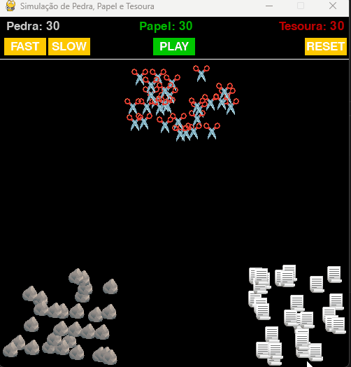

# 🗿📄✂️ Simulação de Pedra, Papel e Tesoura em Pygame


Uma simulação dinâmica e interativa do clássico jogo "Pedra, Papel e Tesoura", desenvolvido em Python com a biblioteca Pygame. Este não é um jogo para dois jogadores, mas sim um "ecossistema" onde múltiplos agentes de cada tipo se movem, colidem e convertem-se com base nas regras do jogo, até que apenas um tipo domine a tela.

## 🎥 Demonstração



## ✨ Funcionalidades Principais

* **Simulação de Autômatos:** Centenas de objetos interagem simultaneamente com regras simples, criando um comportamento complexo e imprevisível.
* **Controles Interativos:** Uma interface de utilizador completa com botões para:
    * **Play:** Iniciar a simulação.
    * **Reset:** Reiniciar a simulação para o estado inicial a qualquer momento.
    * **Fast/Slow:** Controlar a velocidade da simulação em tempo real.
* **Física de Movimento:** Cada objeto tem um vetor de velocidade inicial aleatório (usando trigonometria para direções de 360º), permitindo que se espalhem de forma natural pela arena.
* **Deteção de Colisão:** Lógica de colisão otimizada para verificar as interações entre todos os objetos a cada frame.
* **Sistema de Partículas:** Um efeito de fogo de artifício celebra a vitória, implementado com um sistema de partículas simples com física de gravidade.
* **Gestão de Estado:** O programa gere diferentes estados (ex: `parado`, `a decorrer`, `terminado`) para controlar a lógica e a exibição dos elementos.
* **Gráficos Personalizados:** Utiliza imagens PNG com transparência para os objetos e emojis para a mensagem de vitória (com uma fonte personalizada).

## 🛠️ Tecnologias Utilizadas

* **Python:** Linguagem principal do projeto.
* **Pygame:** Biblioteca para a criação da janela, renderização de gráficos, gestão de eventos e som.
* **Math:** Biblioteca padrão do Python, usada para os cálculos de trigonometria do movimento.
* **Random:** Biblioteca padrão do Python, usada para a aleatoriedade das posições e direções.

## 🚀 Como Executar o Projeto

1.  **Clone o repositório:**
    ```bash
    git clone [https://github.com/pedrohrqb/projeto-jogo.git)
    ```

2.  **Instale as dependências:**
    Certifique-se de que tem o Python 3 instalado. Depois, instale o Pygame:
    ```bash
    pip install pygame
    ```

3.  **Verifique os Ficheiros:**
    Certifique-se de que as imagens (`pedra.png`, etc.) estão nos ficheiros `.py`.

4.  **Execute o programa:**
    ```bash
    python simulacao.py
    ```

## 📂 Estrutura do Projeto

* `simulacao.py`: O ficheiro principal que contém o loop do jogo, a gestão de eventos, a interface e a lógica principal da simulação.
* `objetos.py`: Contém a classe `GameObject`, que serve de "molde" para cada pedra, papel e tesoura, definindo o seu comportamento individual.
* `particula.py`: Contém a classe `Particula`, usada para criar cada faísca do efeito de fogo de artifício.
